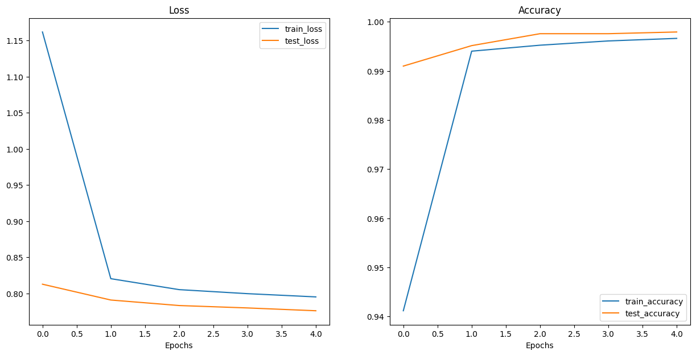

# AnimalVision 🦁🐘🐊

**AnimalVision** is an animal image classifier that detects 64 different kinds of animals using a feature extractor based on EfficientNet-B2. You can see it in action here: [AnimalVision on Hugging Face Spaces](https://huggingface.co/spaces/Baron98/AnimalVision).

## Model Overview

AnimalVision uses **EfficientNet-B2** architecture with PyTorch's default pre-trained weights. It has been fine-tuned on a specialized dataset containing 64 classes of animal images from the [Kaggle dataset by Anthony Therrien](https://www.kaggle.com/datasets/anthonytherrien/image-classification-64-classes-animal).

### Key Features:
- **64 Animal Classes**: The model can classify images into 64 different animal categories.
- **EfficientNet-B2 Backbone**: Lightweight and efficient architecture optimized for performance and accuracy.
- **Trained on Kaggle Dataset**: Fine-tuned on a dataset with over 64 animal species for improved real-world accuracy.

## Training & Performance

The model was trained for 5 epochs. Below are the final training and testing performance results:

- **Epoch**: 5  
- **Training Loss**: 0.7951  
- **Training Accuracy**: 99.66%  
- **Testing Loss**: 0.7759  
- **Testing Accuracy**: 99.79%

## How to Use on Hugging Face:
Simply access the web interface via [Hugging Face Spaces](https://huggingface.co/spaces/Baron98/AnimalVision) and upload an image of an animal!

## Dataset

The model was fine-tuned on the Kaggle dataset from [Anthony Therrien](https://www.kaggle.com/datasets/anthonytherrien/image-classification-64-classes-anim). This dataset contains a variety of animal species with labeled images, making it ideal for multi-class classification tasks.

## Acknowledgements

- **EfficientNet**: Pretrained weights provided by [PyTorch](https://pytorch.org/).
- **Kaggle**: Animal images dataset available at [Kaggle](https://www.kaggle.com/datasets/anthonytherrien/image-classification-64-classes-animal).
